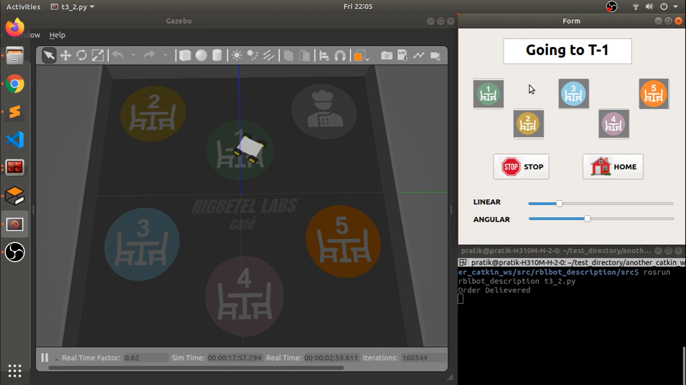

# ROS Waiter Robot controlled using PyQt5 GUI

# **Details About Project**

## Software Used
- Fusion360 -> For designing the 3D Model of the robot.
- [fusion2urdf](https://github.com/syuntoku14/fusion2urdf) -> Fusion360 script to export urdf from fusion 360 directly. 
- ROS (Robot Operating System) 
- Gazebo 
- Rviz 
- PyQt5 -> For GUI
- Python 3

## Clone this repository inside your ROS Workspace:
```
cd ~/catkin_ws/src/
git clone https://github.com/nilutpolkashyap/ros_gui_waiter_bot
cd ~/catkin_ws/
catkin_make
source devel/setup.bash
```

## Launch the simulation
Type the command in a terminal to launch the Gripper Bot world simulation:
```
roslaunch ros_gui_waiter_bot irckt.launch
```
<div align="center">
</div><br />

Type the command in another terminal to run the GUI:
```
cd ~/catkin_ws/src/ros_gui_waiter_bot/src
python3 task3.py
```
<div align="center">
</div>

## Output
<div align="center">

<br />
</div>


